Problem 1
---------

1.  

<!-- -->

    data=read_csv("biden.csv")%>%na.omit()%>%mutate(dem=factor(dem),rep=factor(rep))
    lm1=lm(biden~age+female+educ,data=data)
    tidy(lm1)

    ##          term estimate std.error statistic  p.value
    ## 1 (Intercept)  68.6210    3.5960     19.08 4.34e-74
    ## 2         age   0.0419    0.0325      1.29 1.98e-01
    ## 3      female   6.1961    1.0967      5.65 1.86e-08
    ## 4        educ  -0.8887    0.2247     -3.96 7.94e-05

    lm1_augment=data%>%mutate(hat = hatvalues(lm1),
             student = rstudent(lm1),
             cooksd = cooks.distance(lm1))%>%mutate(obs_num = as.numeric(rownames(.)))

    filter=lm1_augment%>%filter(hat > 2 * mean(hat) |
               abs(student) >2 |
               cooksd > 4 /(nrow(.) - (length(coef(lm1)) - 1) - 1))
    mean_hat=mean(hat)
    ggplot(filter, aes(hat, student)) +
      geom_hline(yintercept = 0, linetype = 2) +
      geom_point(aes(size = cooksd), shape = 1) +
      geom_vline(xintercept = 2*mean_hat, color='red',linetype = 2) +
      scale_size_continuous(range = c(1, 20)) +
      labs(x = "Leverage",
           y = "Studentized residual") +
      theme(legend.position = "none")

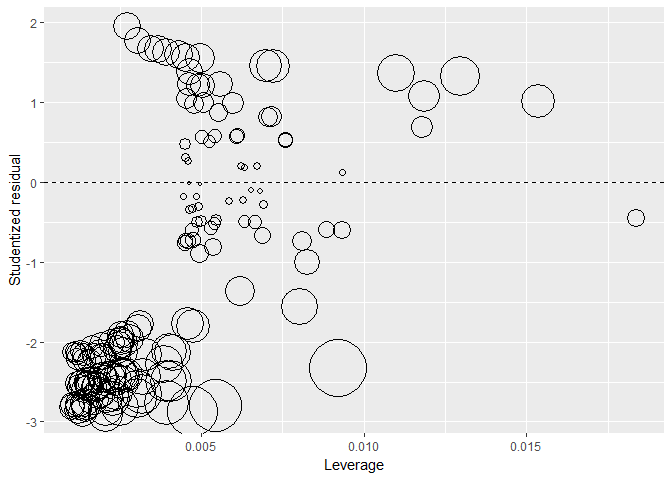

Now we have idendified the unusal and influential points, let's exam
them further.

    lm1_augment <- lm1_augment %>%
      mutate(`Unusual or Influential` = ifelse(obs_num %in% filter$obs_num, "TRUE", "FALSE"))
    lm1_augment %>% 
      ggplot(aes(age, fill = `Unusual or Influential`)) +
        geom_histogram(bins = 10) + 
        labs(title = "Age",
             subtitle = "All Observations with High Leverage, Discrepancy, or Influence",
             x = "Age",
             y = "Count")

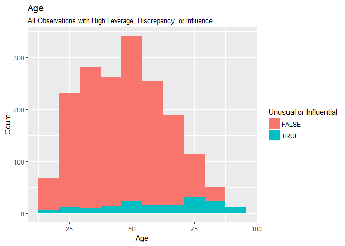

    lm1_augment %>% 
      ggplot(aes(biden, fill = `Unusual or Influential`)) +
        geom_histogram(bins = 10) + 
        labs(title = "Biden Warmth Score",
             subtitle = "All Observations with High Leverage, Discrepancy, or Influence",
             x = "Score",
             y = "Count")

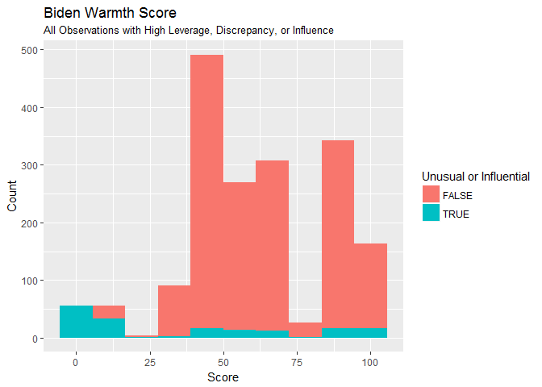

    lm1_augment %>% 
      mutate(female = ifelse(female == 1, "Female", "Male")) %>%
      ggplot(aes(female, fill = `Unusual or Influential`)) +
        geom_histogram(stat = "count", bins = 10) + 
        labs(title = "Gender",
             subtitle = "All Observations with High Leverage, Discrepancy, or Influence",
             x = "Gender",
             y = "Count")

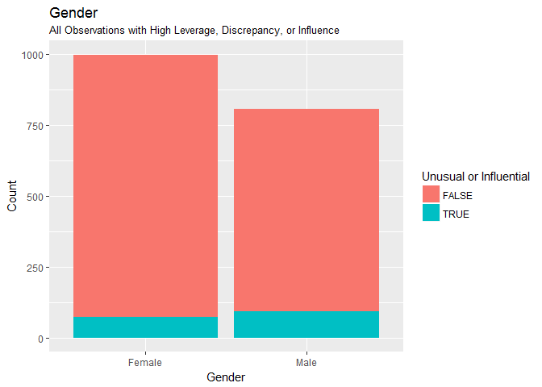

    lm1_augment %>% 
      ggplot(aes(educ, fill = `Unusual or Influential`)) +
        geom_histogram(stat = "count", bins = 10) + 
        labs(title = "Education",
             subtitle = "All Observations with High Leverage, Discrepancy, or Influence",
             x = "Education",
             y = "Count")

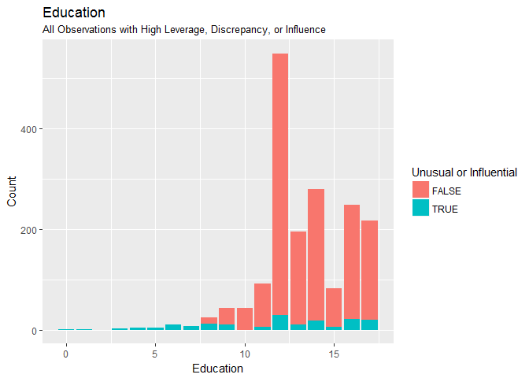

    lm1_augment %>% 
      mutate(party = ifelse(dem == 1, "Democrat", 
                            ifelse(rep == 1, "Republican",
                                   "Independent"))) %>%
      ggplot(aes(party, fill = `Unusual or Influential`)) +
        geom_histogram(stat = "count", bins = 10) + 
        labs(title = "Party Affiliation",
             subtitle = "All Observations with High Leverage, Discrepancy, or Influence",
             x = "Party",
             y = "Count")

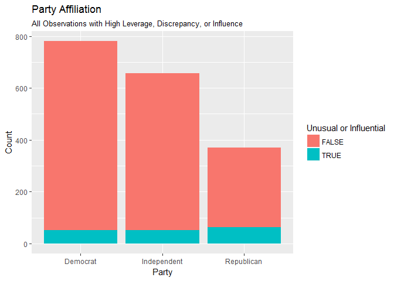

From above analysis, we could see that order male who are a rep and give
low biden score are usually in the usnual or influential group.

1.  

<!-- -->

    car::qqPlot(lm1)

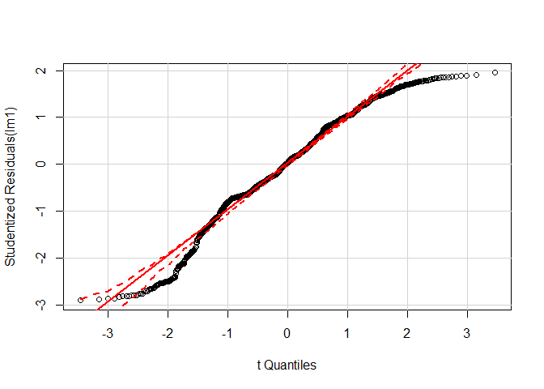

The above quantile-comparison plot shows that many data points are out
of the 95% C.I., which indicates the violation of the nomrality
assumption.

    lm2=lm(biden+1 ~ age + female + educ,data=data)
    boxCox(lm2)

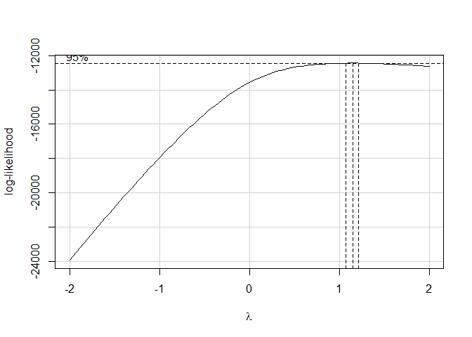

As we can see, the boxcox method suggest a lamda 1.2 transformation.

    lm3=lm(biden^1.2~age+female+educ,data=data)
    car::qqPlot(lm3)

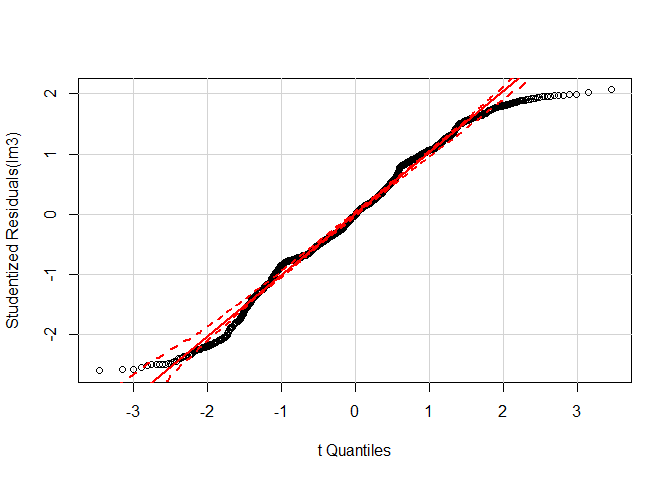 As we can
see the normality assumption is baiicly held in above plot.

1.  

<!-- -->

    data %>%
      add_predictions(lm1) %>%
      add_residuals(lm1) %>%
      ggplot(aes(pred, resid)) +
      geom_point(alpha = .2) +
      geom_hline(yintercept = 0, linetype = 2) +
      geom_quantile(method = "rqss", lambda = 5, quantiles = c(.05, .95)) +
      labs(title = "Homoscedastic variance of error terms",
           x = "Predicted values",
           y = "Residuals")

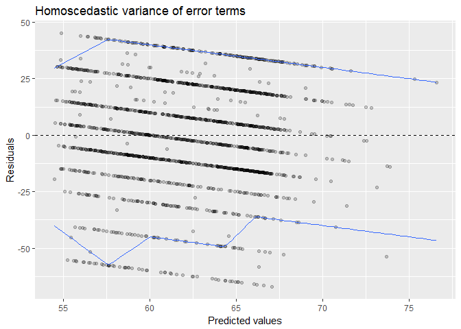

    bptest(lm1)

    ## 
    ##  studentized Breusch-Pagan test
    ## 
    ## data:  lm1
    ## BP = 20, df = 3, p-value = 5e-05

The above tests show that there exist heteroscedasticity in the model.
It may result in biased standard errors estimations and thus inaccurate
statistics and C.I..

1.  

<!-- -->

    vif(lm1)

    ##    age female   educ 
    ##   1.01   1.00   1.01

There is no multicollinearity in the model.

Problem 2
---------

1.  

<!-- -->

    lm4=lm(biden~age*educ,data=data)
    tidy(lm4)

    ##          term estimate std.error statistic  p.value
    ## 1 (Intercept)   38.374    9.5636      4.01 6.25e-05
    ## 2         age    0.672    0.1705      3.94 8.43e-05
    ## 3        educ    1.657    0.7140      2.32 2.04e-02
    ## 4    age:educ   -0.048    0.0129     -3.72 2.03e-04

    instant_effect <- function(model, mod_var){
      # get interaction term name
      int.name <- names(model$coefficients)[[which(str_detect(names(model$coefficients), ":"))]]
      
      marg_var <- str_split(int.name, ":")[[1]][[which(str_split(int.name, ":")[[1]] != mod_var)]]
      
      # store coefficients and covariance matrix
      beta.hat <- coef(model)
      cov <- vcov(model)
      
      # possible set of values for mod_var
      if(class(model)[[1]] == "lm"){
        z <- seq(min(model$model[[mod_var]]), max(model$model[[mod_var]]))
      } else {
        z <- seq(min(model$data[[mod_var]]), max(model$data[[mod_var]]))
      }
      
      # calculate instantaneous effect
      dy.dx <- beta.hat[[marg_var]] + beta.hat[[int.name]] * z
      
      # calculate standard errors for instantaeous effect
      se.dy.dx <- sqrt(cov[marg_var, marg_var] +
                         z^2 * cov[int.name, int.name] +
                         2 * z * cov[marg_var, int.name])
      
      # combine into data frame
      data_frame(z = z,
                 dy.dx = dy.dx,
                 se = se.dy.dx)
    }

    # point range plot
    instant_effect(lm4, "educ") %>%
      ggplot(aes(z, dy.dx,
                 ymin = dy.dx - 1.96 * se,
                 ymax = dy.dx + 1.96 * se)) +
      geom_pointrange() +
      geom_hline(yintercept = 0, linetype = 2) +
      labs(title = "Marginal effect of age",
           subtitle = "By respondent education",
           x = "Education",
           y = "Estimated marginal effect")

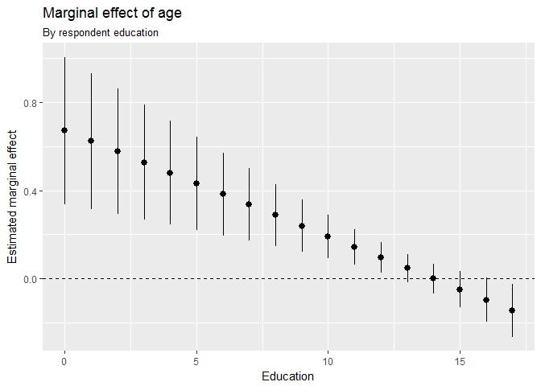

The marginal effect of age is estimated above.

    linearHypothesis(lm4, "age + age:educ")

    ## Linear hypothesis test
    ## 
    ## Hypothesis:
    ## age  + age:educ = 0
    ## 
    ## Model 1: restricted model
    ## Model 2: biden ~ age * educ
    ## 
    ##   Res.Df    RSS Df Sum of Sq    F Pr(>F)    
    ## 1   1804 985149                             
    ## 2   1803 976688  1      8461 15.6  8e-05 ***
    ## ---
    ## Signif. codes:  0 '***' 0.001 '**' 0.01 '*' 0.05 '.' 0.1 ' ' 1

The above test shows that the marginal effect of age is significant.

1.  

<!-- -->

    instant_effect(lm4, "age") %>%
      ggplot(aes(z, dy.dx,
                 ymin = dy.dx - 1.96 * se,
                 ymax = dy.dx + 1.96 * se)) +
      geom_pointrange() +
      geom_hline(yintercept = 0, linetype = 2) +
      labs(title = "Marginal effect of education",
           subtitle = "By respondent age",
           x = "Age",
           y = "Estimated marginal effect")

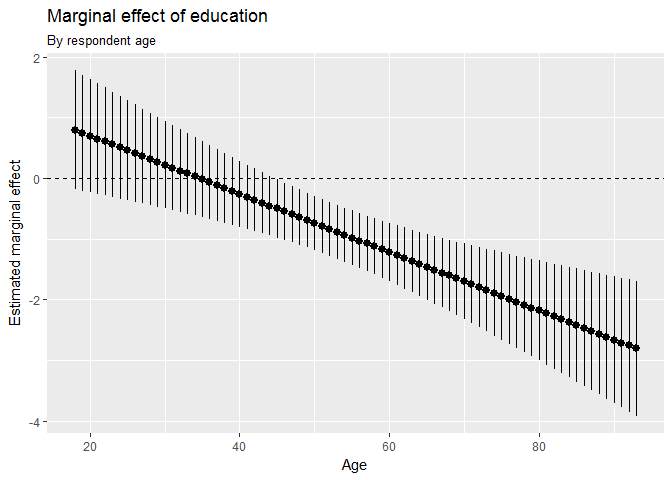

The marginal effect of the education is estimated above.

    linearHypothesis(lm4, "educ + age:educ")

    ## Linear hypothesis test
    ## 
    ## Hypothesis:
    ## educ  + age:educ = 0
    ## 
    ## Model 1: restricted model
    ## Model 2: biden ~ age * educ
    ## 
    ##   Res.Df    RSS Df Sum of Sq    F Pr(>F)  
    ## 1   1804 979537                           
    ## 2   1803 976688  1      2849 5.26  0.022 *
    ## ---
    ## Signif. codes:  0 '***' 0.001 '**' 0.01 '*' 0.05 '.' 0.1 ' ' 1

The above test shows that the marginal effect of education is
significant.

problem3
--------

First, I would like to test multivariate normality for the data using
mardiatest.

    data<-read_csv('biden.csv')  %>%
      mutate(obs_num = as.numeric(rownames(.))) %>%
      mutate(dem = factor(dem),
             rep = factor(rep))
    data1=data%>%select(educ,age)
    mardiaTest(data1,qqplot=TRUE)

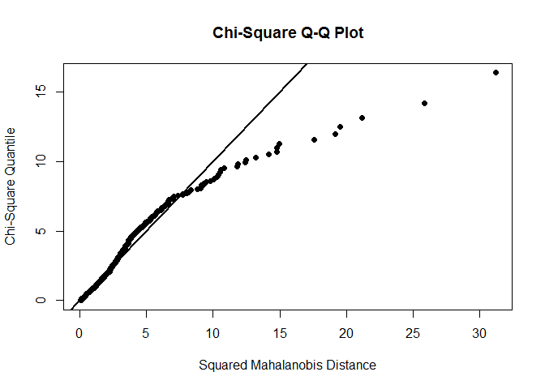

    ##    Mardia's Multivariate Normality Test 
    ## --------------------------------------- 
    ##    data : data1 
    ## 
    ##    g1p            : 0.658 
    ##    chi.skew       : 198 
    ##    p.value.skew   : 9.9e-42 
    ## 
    ##    g2p            : 8.92 
    ##    z.kurtosis     : 4.91 
    ##    p.value.kurt   : 9.14e-07 
    ## 
    ##    chi.small.skew : 199 
    ##    p.value.small  : 7.55e-42 
    ## 
    ##    Result          : Data are not multivariate normal. 
    ## ---------------------------------------

From the above results we could tell the data is not multivariate
normal. We could do a power transformation.

    data2=data1%>%mutate(new_age=age^2,new_educ=educ^2)
    mardiaTest(data2%>%select(new_educ,new_age),qqplot=TRUE)

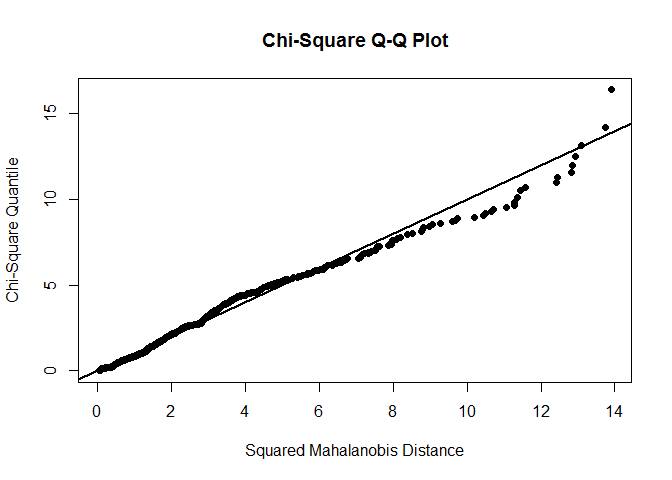

    ##    Mardia's Multivariate Normality Test 
    ## --------------------------------------- 
    ##    data : data2 %>% select(new_educ, new_age) 
    ## 
    ##    g1p            : 0.983 
    ##    chi.skew       : 296 
    ##    p.value.skew   : 7.71e-63 
    ## 
    ##    g2p            : 8.01 
    ##    z.kurtosis     : 0.0515 
    ##    p.value.kurt   : 0.959 
    ## 
    ##    chi.small.skew : 297 
    ##    p.value.small  : 5.13e-63 
    ## 
    ##    Result          : Data are not multivariate normal. 
    ## ---------------------------------------

There is slight improvement but does not solve the non-normal issue.
